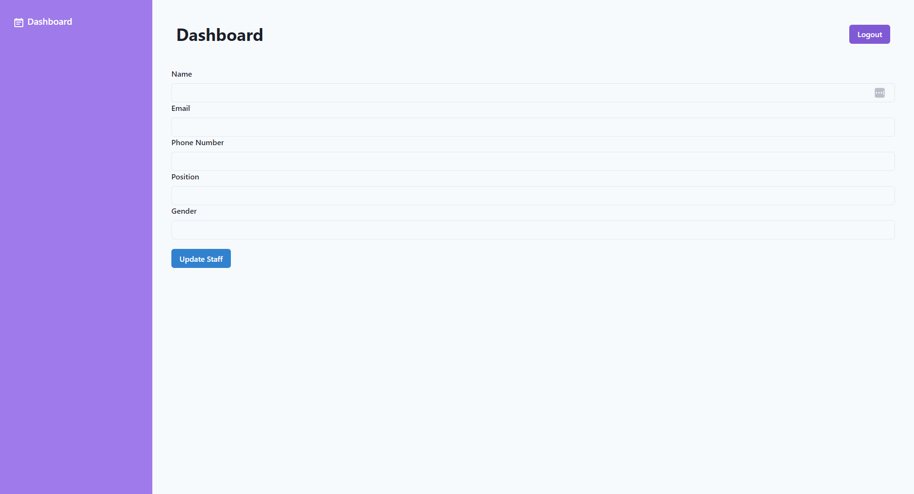
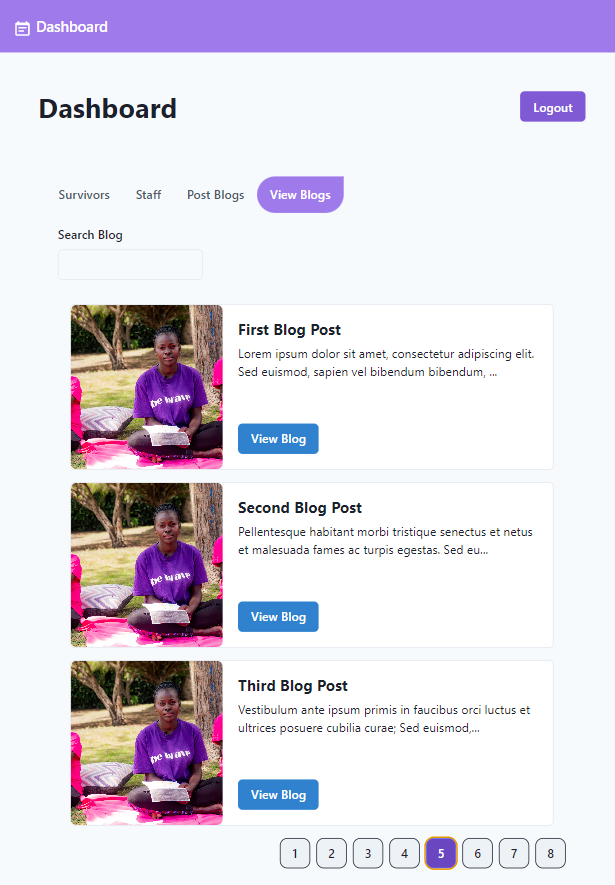
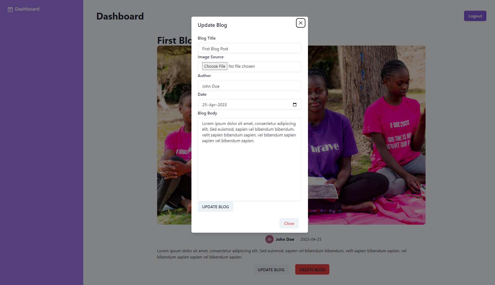

# REBIRTH OF A QUEEN ADMIN DASHBOARD.

This is the prototype admin dashboard for Rebirth of a Queen organization.
The dashboard is designed to help the organization administrators manage:

1. Survivors' Data.
2. Staff Data.
3. Blog Data.

The dashboard provides a simple user-friendly interface that allows administrators to perform the following tasks:

## Survivors' & Staff Management:
The following Survivor/Staff actions can be performed on this dashboard:

* View a paginated list of all Survivors/Staff in the database

	* View all Survivors
	

	* View all staff members
	

* View more details about each Survivor/Staff
	* More Details about each Survivor (Mobile View)
	

	* More Details about each Staff Member (Tablet View)
	

* Add a Survivor/Staff to the database
	* Add Survivor 
	
	
	* Add a Staff Member
	
* Update a Survivor's/Staff's details
	* Update a Survivor's Detail
	

	* Update a Staff Member's Details.
	

* Delete a Survivor/Staff from the database
	* Delete a survivor from the database.
	
	

## Blog Management
* An administrator can post a blog from the dashboard. A blog posted from this dashboard will be displayed on the client website:

	

* An administrator can also view the blogs posted and either edit the blog content or delete the blog:

	* View all blogs (Tablet View):
	

	* View blog details:
	

	* Update blog details:
	
### Responsiveness
This app is fully responsive across devices:
* #### Desktop View

* #### Tablet View

* #### Mobile View

## Technologies

## Authors
##### Project Contributed to by:

* [Ismahan Abdirizak](https://github.com/ismahaneyy)

* [Michelle Mungai](https://github.com/Michelle-Mungai)

* [Bob Oyier](https://github.com/oyieroyier)

* [Abdiaziz Abdullahi](https://github.com/AbdiazizAbdullahi)

* [Sammy Cherono](https://github.com/Sammy-CK)

* [Brian Isaboke](https://github.com/Osorabrian)

### MIT License (MIT)

